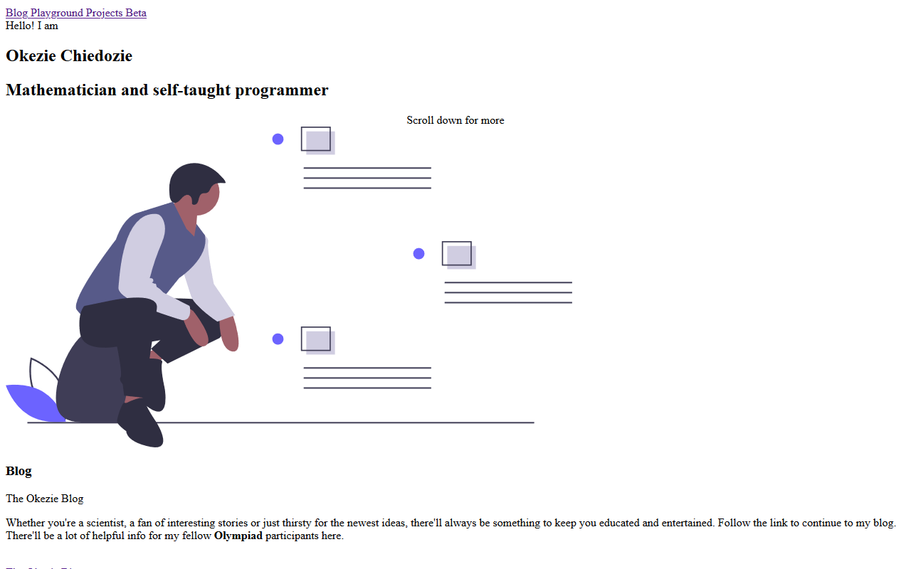

When you open a website, a connection is made to a server and the server in return sends some files back to your browser. Your browser then uses this files to construct what you see on your computer. Today, I will be discussing the three major files that are required to display webpages.

## HTML

HTML which stands for **HyperText Markup Language** is a very common language that is used to design web interfaces. Its major function is to define that elements that will show on the website. Such an element could be a paragraph of text, an image, a text-box, a button, etc. The browser uses the HTML file that it receives to create a [Document Object Model](https://www.w3schools.com/whatis/whatis_htmldom.asp "What is HTML DOM") of the page. HTML documents start and end with and end with the extension “.html”. HTML on its own, however, cannot create very beautiful websites so it is used together with CSS.

## CSS

CSS stands for **cascading style sheet**. It is used to give style to a HTML application. If I didn't add CSS to my website, it will be looking like this.

If you see the image above you will agree with me that it is just plain. CSS does almost every styling in a website like making text bold or italicized, adding colors to elements, placing an element on the left of the page or on the right. CSS is just about how the website looks to the user. So CSS is what makes the difference between a pae full of randomly scattered text and a well looking and organized page.

## JS

JavaScript is a scripting language. It is the major working part of a website. One of its functions is that it is a bridge between the website and you. Imagine you are watching a YouTube video and then you see an ad. After some time, you see a skip button on the ad. When you click that button to close the ad, you are basically telling JavaScript to get that ad out of your way. JavaScript understands your sorrows, so he in turn tells the HTML part of the website that you don’t want to see that ad, and then HTML removes it. JavaScript also other tasks in the background like fetching data from APIs, sending POST and GET requests, etc.

In order to see the HTML, CSS and JS files that are used in a website, you can right-click an empty space in the site and click view source code.

These three programming languages work together to give a website its functionality. HTML is the part that shows you the elements, CSS makes the element to have style and look good, while JS facilitates communication between the browser and you and other tasks.