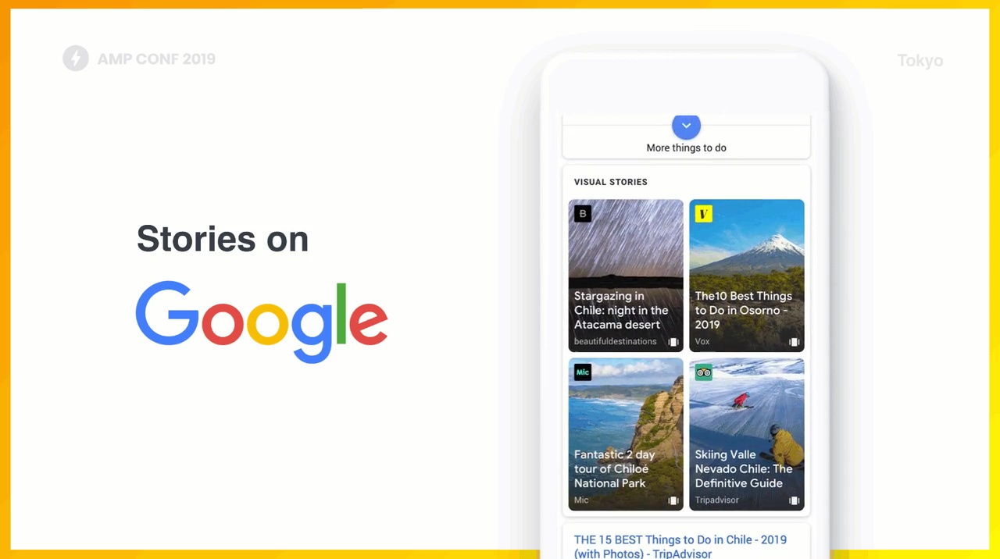
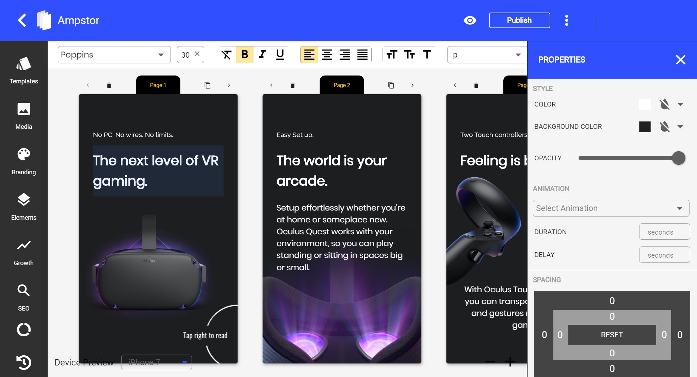
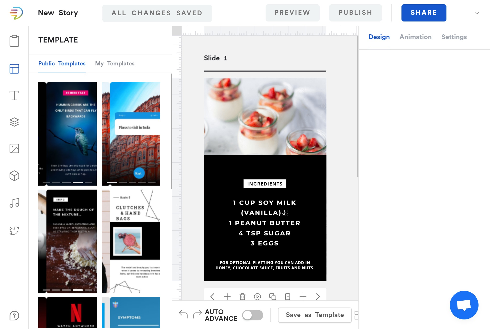

## What are AMP Stories

AMP stories are part of Google's AMP project that enables supported search results  from google to open as quickly as possible. This is due to the strict restrictions to what scripts or style the website can contain as there are particular scripts that AMP pages work with. Next time when you open a google search result and you see the thunderbolt sign on the url bar, you are on an AMP page

AMP stories are AMP pages that are visually rich and are typically displayed as full screen images with text overlayed on it.  These stories work in a way that is similar to the stories found on social networks. The reader can then tap through the slides of the story by tapping on the edges of the screen.

## Why you should care about AMP

Most traffic a website recieves comes from being seen on Google search results, so the higher you rank on search results, the mpre traffic that you expect on your site. As part of a way of encouraging people to create AMP pages, google gave pages that use AMP a special placement at the top of AMP results.\[^footnote\]

They also reinforce the guidelines on the way you make your AMP stories by only including pages that satisfy them to be included in the top carousel/visual stories section. This means that, a very important thing to do after creating your story is to pass it through an AMP validator to make sure there are no errors in the markup that may prevent it from getting a place in the search results.

## Two ways of going about creating AMP Stories

There are two divergent paths I suggest you have to choose between while creating your AMP stories.

1. Creating your own templates and writing code for them
2. Using a WYSIWYG editor

In this article, we will only be looking at WYSIWYG editors

WYSIWYG is an acronym for What-You-See-is-What-You-Get. If you decide to make your own templates, you will be writing many lines of code but WYSIWYG editors make the process easier by providing you a visual interface to create your stories. When you use these editors, all you have to do is to write text and place images and you will be done.

Today we'll be comparing two AMP story makers that I am very familiar with - Ampstor and MakeStories. Both websites make it very clear on their website that the editor is truly visual and there is zero coding required to create your AMP story. Both websites are in beta stage but they have worked perfectly for me so far, except for a few bugs, and there is little or nothing to worry about.

In comparing the two editors, we will look at some factors that you should definitely put into consideration in deciding which editor you want to work with

1. The number of already made templates that they offer to you
2. How easy it is to use the site and whether to expect lags
3. The tools that they have put in place to make it easier to search for media content that you will use
4. How straightforward or easy it is to add your SEO metadata to the stories that you make
5. The different options that you are offered on how to publish your story when you are done building them.

## Number of available templates

An editor having more templates helps make each of your stories you publish stand out and have a unique look and not look like a recycled version of another story that you already made. If the stories you are planning to make are about a product, I feel like MakeStories will be a good option for you because they have a handful of templates that will be perfect for you to pitch your product to your potentianl customers. If you stories are geared away from a product  or you are planning to create a very huge number of stories, then Ampstor will be the good choice for you. If we count the number of templates that are available in the two platforms, the number of templates on Ampstor is very much larger than that of MakeStories.

  

## Site Responsiveness and ease of use

After using both the editors, I can in terms of performnce and ease of use, MakeStories is a lot better than that of Ampstor. The Ampstor page has very minor lags that you will easily percieve while using it, so you may have to wait for some milliseconds after typing to see what you typed appear. Meanwhile on MakeStories, evrything is fluid, and the site responds to clicks quickly. In MakeStories, you can organize your stories in different folders, so iff you are planning on creating a lot of stories and want your workplace to be organized, the MakeStories has exactly what you need. In Ampstor, you can give tags to stories, and using tags can help you stay organized but folders are a lot easier to work with as we are already used to them.

  

## Media Availability

Photos are a huge part of AMP stories as that is almost what AMP Stories are all about. Availability of high quality photos on each of these platforms is very important to successful content creation. Both of the websites make use of the Unsplash API to fetch images so finding photos wont be a problem. Unsplash is an online media library that boasts over 2 million photos so you will likely fins an image for whatever you are looking for from the search. In the unlikely event that you can't find an image, they also both have  an import functionality so you can download your images from elsewhere and import them into your story. You are not only limited to images on AMP stories so you can make use of videos and background music. MakeStories has an edge based on this beacause they provide you different menus from which you can either pick a photo, an illustration, or a video from online sources. This is a functionality I am yet to see on Ampstor(or I have not noticed it yet).

## SEO Optimization

SEO is a heart of running a website because it is the thing that will get people to come to your site. For AMP Stories, the SEO metadata needed is mostly thename of the author, publisher and then cover images that will be displayed on the Google visual storis carousel. MakeStories has a better way of allowing you to add SEO metadata to your stories. In the settings of MakeStories, you can set the author name, publisher favicon and add your analytics info there and all that metadata will automatically be added to the stories that you make. On Ampstor, there is no such setting as you have to go individually and add the relevant SEO and analytics data to your story.

## Story Publishing

The most important part of the whole AMP story making stuff is publishing the content you made because then is when the content goes live. On Ampstor, you have four options on how to publish you story. You can export your code to HTML and put the HTML on your website, upload it to your own servers via FTP, publish it to a webflow or host it with Ampstor on their website.

On MakeStories, you can export the story to a zip file or send your stories via FTP to location where they will be served from. MakeStories can also host your stories for you on an onl.st shortlink if you don't have your own hosting. There are other options on MakeStories like widget embed, Wordpress and AWS Publish.

## Final Verdict

MakeStories beats Ampstor in majority of the factors considered especially site responsiveness and ease of use, which I consider important because no one prefers slow things. However Ampstor beats MakeStories on the greatest criteria to me which is the ammount of templates that are available so I will say that if you plan on creating just not too many stories MakeStories will be the perfect for you but if you plan on creating a lot, then should be in a big dillems - to choose a large number of very good themes(Ampstor) or to choose the one that is easier to use but less diverse in templates (MakeStories), but I hope the descriptions I made here will be sufficient for you to make your choice. You can also decide to work with both of them simultaneously to take advantage of the speed of one and the ammount of templates the other has to offer.

Another good AMP Story creator that I have not described here is Tappable. They are also in a private beta stage so you can register to get an access code.

### Links to the various websites

All the various services here offer the service for free as at the time of writing.

1. [Ampstor]()
2. [MakeStories](https://makestories.io/ "MakeStories website")
3. [Tappable.co](tappable.co "Tappable AMP Story Creator")
4. [AMP official website](https://amp.dev/about/stories/ "AMP official website")

***

If you want to have more control over how the stories you make look like, then you can create your own template but there will be a lot of coding involved. I will create a detailed introduction to writing code for AMP stories so you should better watch out for it.